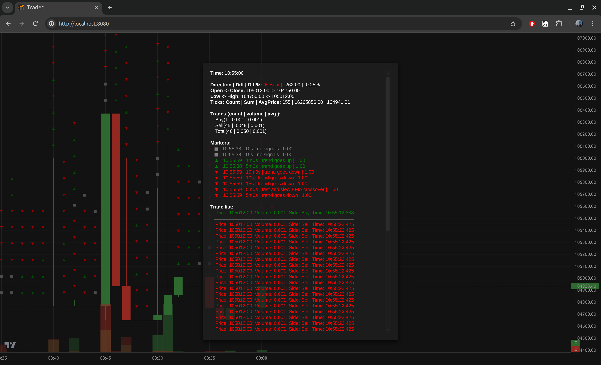

# 🌀 GoTrade: Real-Time Modular Trading Framework for Crypto Futures

**GoTrade** is a blazing-fast, modular trading framework written in Go (backend) and JavaScript (frontend), designed for real-time futures trading on Bybit, but easily extensible to any exchange or asset.

Whether you're building a scalping bot, strategy tester, or visual market monitor — GoTrade gives you the infrastructure.

---

## 🚀 Features

### ✅ Real-Time Engine

- Tick-level market data listener (tested with [Bybit](https://www.bybit.com/en/) WebSocket)
- Real-time candle aggregation across **unlimited timeframes**
- Candle-based **live signal calculation** on *every single tick*
- Supports **multiple concurrent signals** per timeframe

### 🧠 Strategy Layer

- Plug in multiple strategies and signals
- Each tick triggers candle update + signal evaluation
- Full market picture in real time from multiple perspectives

### 🛠️ Position Manager

- Smart position control (open/close/adjust based on signals)
- Integrated **risk management**
- Dynamic **trailing stop logic**

### 📊 Web UI (TradingView-style)

- Built-in web server with live chart rendering
- Displays:
    - Candles and trades
    - Signals on candles
    - Position markers (entry/exit/stop)
    - Signal metadata and trigger details

### 🔮 Roadmap (In Progress)

- 🔁 Local exchange simulator for safe strategy dev
- ⏪ Historical backtesting with candle reconstruction
- 🧪 Automatic parameter tuning for strategy optimization

---

## 🧩 Stack

- **Backend:** Go (performance-first, concurrency-ready)
- **Frontend:** JavaScript + [TradingView](https://www.tradingview.com/) chart
- **API:** WebSocket for market data + REST for execution

---

## 📷 Screenshot



---

## 📦 Installation

```bash
git clone https://github.com/kirill-a-belov/gotrade
cd gotrade
go build
./gotrade
